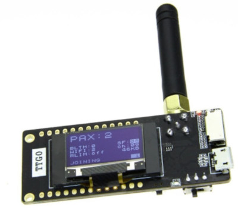

 

# Introduction
**Turn your Android phone into real Amateur Radio HF/VHF/UHF APRS enabled Codec2 DV (digital voice) handheld transceiver. Requires additional hardware,  software (e.g. Direwolf) radio modem or analog transceiver.**

For more information visit project [Wiki](https://github.com/sh123/codec2_talkie/wiki)

This minimalistic Android application is Amateur Radio Walkie-Talkie style digital voice frontend for your radio modem, which uses open source [Codec2](https://github.com/drowe67/codec2) for speech audio frame encoding/decoding with additional AX.25/APRS support.

It is mainly intended for Amateur Radio DV experimentation with ultra low cost 3-8 dollar radio modems, such as LoRa and 15-25 dollar ESP32 board flavors with built-in LoRa module: T-Beam,
LoPy, TTGO, Heltec and others, but could also be used with custom hardware of software (Direwolf) modems + external transceivers or as a test harness for Codec2 frames generation and their playback.

Application connects to your radio KISS Bluetooth/BLE/USB/TCPIP modem, records speech from the phone microphone on transmit, encodes audio into Codec2 format, encapsulates into KISS frames (plus into AX.25 frames if enabled in settings) and sends to your modem. 
On receive, modem sends KISS packets to the phone with Codec2 speech, application decodes Codec2 samples and plays them through phone speaker. Application also supports APRS tracking, so you can submit your position into APRS in plain, compressed or Mic-E format.

It does not deal with radio management, modulation, etc, it is up to your modem and radio, it could be just AFSK1200, GMSK 9600, LoRa, FSK, FreeDV or any other modulation scheme. Radio just needs to expose KISS Bluetooth/BLE/USB/TCPIP interface for speech frames and optional radio control.

# Requirements
- Android 7.0 (API 24) or higher
  - Application could also be used with your Android network radio, such as Inrico TM-7, apk just needs to be installed over USB, see [Discussion](https://github.com/sh123/codec2_talkie/issues/4)
- Android 5.0, 5.1, 6.0 (API 21, 22, 23)
  - Separate apk package is released with "legacy" suffix from legacy branch
- Modem, radio module or transceiver which supports [KISS protocol](https://en.wikipedia.org/wiki/KISS_(TNC)) or can process KISS or raw Codec2 audio frames over serial Bluetooth, BLE, USB or TCP/IP
- Analog transceiver with built-in or external USB audio adapter and VOX or USB CAT PTT control (such as MCHF or iCom IC-7x00 series)

# Dependencies
- Source code is integrated into this project for easier building and customization:
  - Codec2 codec: https://github.com/drowe67/codec2
  - Android Codec2 wrapper code: https://github.com/UstadMobile/Codec2-Android
- Fetched with gradle as dependency:
  - Android USB serial: https://github.com/mik3y/usb-serial-for-android

# Other similar or related projects
- ESP32 LoRa APRS modem (used with this application for testing): https://github.com/sh123/esp32_loraprs
- Version adopted for M17 protocol usage: https://github.com/mobilinkd/m17-kiss-ht
- iOS Codec2 wrapper: https://github.com/Beartooth/codec2-ios
- Minimal Arduino LoRa KISS modem: https://github.com/sh123/lora_arduino_kiss_modem
- Minimal Arduino NRF24 KISS modem: https://github.com/sh123/nrf24l01_arduino_kiss_modem
- Other interesting projects:
  - LoRa mesh text GPS communicator: https://github.com/meshtastic/Meshtastic-device
