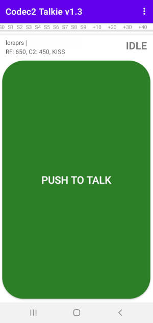

# Android Codec2 Walkie-Talkie
Android KISS Bluetooth modem client for Amateur Radio digital voice communication by using open source [Codec2](https://github.com/drowe67/codec2).

# Introduction
This Android application is a digital voice frontend for your radio. It connects to your radio KISS Bluetooth modem, sends and receives Codec2 audio frames, which are encapsulated inside KISS frames. It does not deal with radio management, modulation, etc, it is up to your modem and radio, it could be just AFSK1200, GMSK 9600, LoRa, FSK, FreeDV or any other modulation scheme. Radio just needs to expose KISS Bluetooth interface.

# Requirements
- Android 6.0 (API 23) or higher
- Modem or transceiver which support [KISS protocol](https://en.wikipedia.org/wiki/KISS_(TNC)) over Bluetooth

# Features
- PTT button, push and talk, encoded speech will be transmitted to the modem
- Bluetooth connectivity on startup, lists paired devices, so you can choose your modem and connect, you need to pair with your Bluetooth device first from the Settings
- Voice codec2 mode selection, which allows you to select various codec2 modes from 450 up to 3200 bps.
- Codec2 loopback mode, which records and plays your recorded voice back to test and evaluate different modes

# Suitable radios
- Tested:
  - LoRa modem: https://github.com/sh123/esp32_loraprs
- Could work, needs testing:
  - Kenwood TH-D74A: https://dl1gkk.com/kenwood-th-d74-bluetooth-packet-radio-setup/
- Requires USB support:
  - AFSK1200 MicroModem: https://unsigned.io/micromodem
  - AFSK1200 PicoAPRS: http://www.db1nto.de/index_en.html

# Related Projects
- Codec2 codec: https://github.com/drowe67/codec2
- Android Codec2 wrapper code: https://github.com/UstadMobile/Codec2-Android
